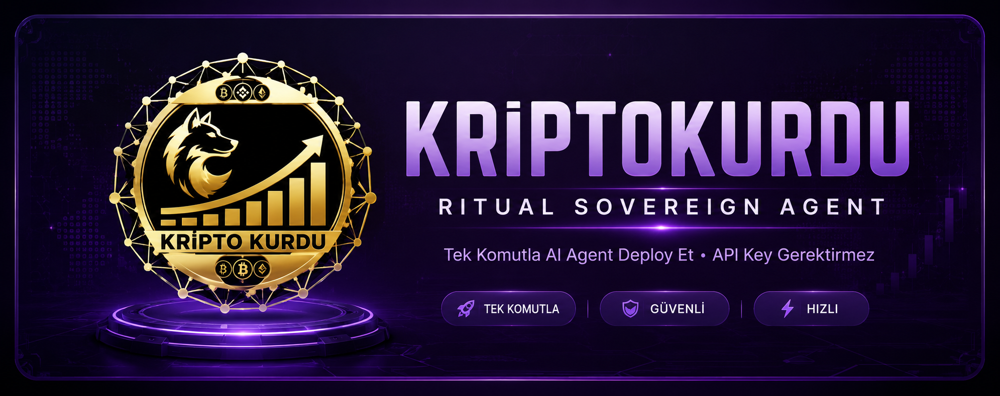

<div align="center">

# 🐺 Kriptokurdu Ritual Sovereign Agent Deployer

**Ritual testnet üzerinde tekrarlayan, kendi kendini finanse eden AI agent'ı tek komutla deploy et. API key gerekmez.**

<a href="https://github.com/eCoxvague"></a>

[](LICENSE)
[](https://ritualfoundation.org)

</div>

---

<h2 align="center">⭐ Bu Nedir? ⭐</h2>

**Sovereign Agent**, belirli bir programa göre kendini uyandıran bir akıllı kontrattır. Her uyanışta güvenli bir ortamda (TEE - Trusted Execution Environment) bir AI agent çalıştırır, bu çalışma için kendi on-chain cüzdanından ödeme yapar ve para bitene kadar çalışmaya devam eder. Tamamen zincir üstünde (on-chain) yaşar.

### 🎯 Ne İşe Yarar?
- 🤖 Otomatik olarak AI görevleri çalıştırır
- 🔒 Güvenli ortamda (TEE) çalışır verileriniz korunur
- 💰 Kendi cüzdanından ödeme yapar müdahale gerekmez
- 🔑 API key gerekmez Ritual'ın kendi LLM gateway'ini kullanır
- ⏰ Zamanlanmış çalışır siz uyurken bile

---

<h2 align="center">📋 Ön Gereksinimler 📋</h2>

Üç şeye ihtiyacınız var. Script geri kalan her şeyi sizin için otomatik kurar (foundry, uv ve Linux/WSL'de curl).

### 1. Git
Kodu indirmek için gerekli. Çoğu sistemde zaten vardır.

```bash
git --version
```

Eğer yoksa:
- **Windows:** [Git for Windows](https://git-scm.com/download/win) kurun veya `winget install Git.Git` çalıştırın
- **macOS:** `xcode-select --install` (veya `brew install git`)
- **Linux / WSL:** `sudo apt install git`

### 2. Ritual Testnet Cüzdanı
MetaMask veya Rabby'de bir cüzdan oluşturun, ardından ücretsiz testnet RITUAL alın:

🚰 **Faucet:** https://faucet.ritualfoundation.org

### 3. Private Key
Cüzdanınızın private key'i (script çalışırken soracak).

> ⚠️ **DİKKAT:** Testnet burner cüzdanı kullanın gerçek para olan cüzdanınızı ASLA kullanmayın!

---

<h2 align="center">🚀 Hızlı Başlangıç 🚀</h2>

### Adım 1 Kodu İndir

```bash
git clone https://github.com/eCoxvague/ritual-agent-deployment.git
cd ritual-agent-deployment
```

### Adım 2 Yapılandır

```bash
cp .env.example .env
```

Varsayılan ayarlar çalışır durumda düzenlemeniz zorunlu değil. `PROMPT` değişkeni agent'ınızın her uyanışta çalıştıracağı görevdir, istediğiniz gibi değiştirin.

### Adım 3 Deploy Et

**Windows (PowerShell 7+):**

```powershell
pwsh run.ps1
```

**Linux / macOS / Git Bash / WSL:**

```bash
bash run.sh
```

> 💡 Script otomatik olarak gerekli araçları (Foundry, uv) kurar. Sizden sadece private key'inizi ve bir keystore şifresi belirlemenizi ister.

---

<h2 align="center">🛠 Agent Yönetimi 🛠</h2>

Her agent, deterministic bir adreste kendi kontratıdır (cüzdan adresi + salt). Adres vermeden komut çalıştırırsanız `.env`'deki `SALT` ile belirlenen agent'a etki eder.

### Windows (PowerShell)

| Komut | Açıklama |
| --- | --- |
| `pwsh run.ps1` | Deploy + fonla + başlat. Zaten bir agent varsa yenisini oluşturmadan önce sorar. |
| `pwsh run.ps1 status` | Tüm agent'larınızı listele (durum + bakiye). |
| `pwsh run.ps1 status <adres>` | Tek bir agent'ın detaylı bilgisi. |
| `pwsh run.ps1 topup <adres> [wei]` | Daha fazla RITUAL ekle (durmuşsa yeniden başlatır). |
| `pwsh run.ps1 restart <adres>` | Durmuş bir agent'ı yeniden başlat. |
| `pwsh run.ps1 stop <adres>` | Bir agent'ı durdur. |

### Linux / macOS / WSL

| Komut | Açıklama |
| --- | --- |
| `bash run.sh` | Deploy + fonla + başlat. |
| `bash run.sh status` | Tüm agent'larınızı listele. |
| `bash run.sh status <adres>` | Tek bir agent'ın detaylı bilgisi. |
| `bash run.sh topup <adres> [wei]` | Daha fazla RITUAL ekle. |
| `bash run.sh restart <adres>` | Durmuş bir agent'ı yeniden başlat. |
| `bash run.sh stop <adres>` | Bir agent'ı durdur. |

**İkinci agent mi istiyorsunuz?** `pwsh run.ps1` (veya `bash run.sh`) tekrar çalıştırın mevcut agent'ı algılar ve yeni bir tane oluşturmak isteyip istemediğinizi sorar.

---

<h2 align="center">⚙️ Yapılandırma ⚙️</h2>

`.env` dosyası sırları içermez yalnızca genel adresiniz ve çalıştırma ayarlarınız burada.

| Değişken | Açıklama |
| --- | --- |
| `RPC_URL` | Ritual testnet RPC endpoint'i. |
| `CHAIN_ID` | `1979` (Ritual testnet). |
| `DEPOSIT_WEI` | Agent cüzdanına kilitlenecek RITUAL miktarı (wei). `0.015 RITUAL` ≈ bir uyanış. |
| `CLI_TYPE` | Harness tipi. `6` = ZeroClaw. |
| `MODEL` | Ritual gateway üzerinden yönlendirilen model (harici key gerekmez). Varsayılan: `zai-org/GLM-4.7-FP8`. |
| `PROMPT` | Agent'ın her uyanışta çalıştırdığı görev. |
| `SALT` | Benzersiz bir string agent adresini belirler. Her agent için farklı olmalı. |
| `LOCK_BLOCKS` | İsteğe bağlı. Depozitonun kilitli kalacağı blok sayısı. Varsayılan: `100000`. |
| `KEYSTORE_ACCOUNT` | İlk çalıştırmada otomatik yazılır keystore adınız. |
| `WALLET_ADDRESS` | İlk çalıştırmada otomatik yazılır genel adresiniz. |

> 🔐 Private key'iniz asla `.env`'e yazılmaz; şifreli olarak `~/.foundry/keystores` klasöründe saklanır. Yine de **testnet burner** cüzdan kullanın.

---

<h2 align="center">🌐 Ağ Bilgileri 🌐</h2>

| Ağ | Chain ID | RPC | Faucet | SovereignAgentFactory |
| --- | --- | --- | --- | --- |
| **Ritual Testnet** | `1979` | `https://rpc.ritualfoundation.org` | [Faucet](https://faucet.ritualfoundation.org) | `0x9dC4C054e53bCc4Ce0A0Ff09E890A7a8e817f304` |

---

<h2 align="center">🔒 Güvenlik Notu 🔒</h2>

- ✅ Private key **şifreli** olarak `~/.foundry/keystores` klasöründe saklanır
- ✅ `.env` dosyasına private key **yazılmaz**
- ✅ Tüm işlemler sadece Ritual testnet üzerinde gerçekleşir
- ✅ Harici sunuculara veri gönderilmez
- ⚠️ Kilitlediğiniz depozito, agent'ın zamanlanmış çalışmaları için harcanır anında geri alınamaz
- ⚠️ Bu bir testnet yazılımıdır audit edilmemiştir

---

<h2 align="center">📜 Sorumluluk Reddi & Lisans 📜</h2>

Bu araç, `~/.foundry/keystores` altında şifreli bir keystore'da saklanan bir anahtarla işlem imzalar testnet burner cüzdan kullanın, asla gerçek fonlu bir cüzdan kullanmayın. Kilitlediğiniz depozito, agent'ın zamanlanmış çalışmalarını finanse eder ve zamanla harcanır kolayca geri alınamaz. Bu bir testnet yazılımıdır, olduğu gibi sunulur, garanti verilmez ve denetlenmemiştir. Riski size aittir.

**MIT Lisansı** altında yayınlanmıştır.
